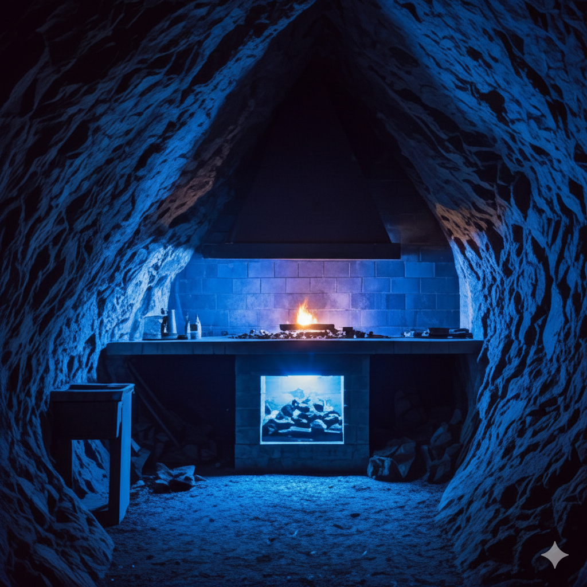
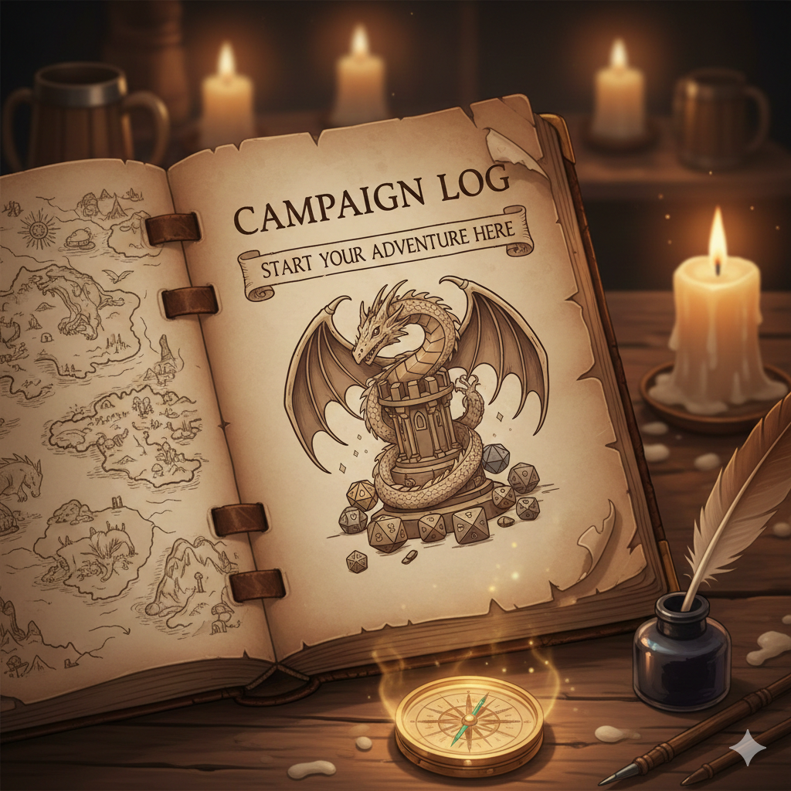

<div>

# Moonforge



<p>
  <a href="https://flutter.dev"></a>
  <a href="https://dart.dev"></a>
  <a href="LICENSE"></a>
  
  <br>
  
  
  
  
  
</p>

<h3>Forge living worlds, not just notes.</h3>

<p>Moonforge is a desktop-first Dungeons & Dragons campaign studio built for marathon tables and lore-heavy worlds. Shape campaigns into chapters, adventures, and scenes, track entities across your setting, and keep everything searchable and available offline. It is a focused command center for Dungeon Masters who want clarity, speed, and continuity across every session.</p>


</div>

---

## Table of Contents

- [Highlights](#highlights)
- [Screenshots](#screenshots)
- [Tech Stack](#tech-stack)
- [Architecture](#architecture)
- [Getting Started](#getting-started)
- [Configuration](#configuration)
- [Code Generation](#code-generation)
- [Testing](#testing)
- [Platform Support](#platform-support)
- [Roadmap](#roadmap)
- [Contributing](#contributing)
- [License](#license)

## ✨ Highlights

* **🧭 Campaign Dashboard:** Search and sort campaigns with a clean card overview.
* **🧱 Structured Outline:** Chapter → adventure → scene tree navigation with ordered numbering.
* **📖 Chapter Workspaces:** Summaries, stats, and linked content panels for adventures and key entities.
* **🗺️ Worldbuilding Entities:** Locations, NPCs, organizations, items, creatures, and encounters as first-class records.
* **🔍 Fast Local Search:** FTS5-backed indexing for offline content lookup.
* **🛰️ Offline-First Sync:** Drift + PowerSync + Supabase with live sync status indicators.

## 📸 Screenshots

<div style="display: flex; flex-wrap: wrap; justify-content: start;">
  
</div>

---

## 🛠️ Tech Stack

| Category | Technology | Description |
| :--- | :--- | :--- |
| **Core** | Flutter 3.x / Dart 3.10 | The primary framework and language. |
| **UI** | shadcn_flutter, flutter_acrylic | Modern components and window styling. |
| **State** | Riverpod | `hooks_riverpod` & `flutter_hooks` for state management. |
| **Routing** | Auto Route | Type-safe routing solution. |
| **Data** | Drift (SQLite) | Local persistence and ORM. |
| **Sync** | PowerSync & Supabase | Offline-first sync engine and backend-as-a-service. |
| **Tooling** | build_runner, envied | Code generation and environment variable management. |

## 🏗️ Architecture

| Path | Purpose |
| :--- | :--- |
| `moonforge/lib/main.dart` | Bootstraps windowing, DI, Supabase, and logging. |
| `moonforge/lib/app.dart` | Wires themes, routing, localization, and deep links. |
| `moonforge/lib/core/` | Cross-cutting services, DI, constants, and logging. |
| `moonforge/lib/data/` | Models, stores, and data utilities. |
| `moonforge/lib/features/` | Modular features (Auth, Campaigns, Dashboard, Command). |
| `moonforge/lib/layout/` | App theme and shared layout widgets. |
| `powersync/` | Sync rules and configuration. |
| `supabase/` | Supabase config and generated types. |

---

## 🚀 Getting Started

### Prerequisites
* Flutter 3.x
* Dart 3.10
* Windows (primary development target)

### Installation

Install dependencies and run the app from the `moonforge/` directory:

```bash
cd moonforge
flutter pub get
flutter run
```

## ⚙️ Configuration

- Environment values live in `moonforge/.env` and are loaded by `envied`.
- Do not commit secrets or local credentials.

## 🧰 Code Generation

Run these from `moonforge/` when making model or schema changes:

```bash
dart run build_runner build --delete-conflicting-outputs
dart run tools/generate_database_classes.dart
```

## ✅ Testing

Run tests from `moonforge/`:

```bash
flutter test
```

## 🧭 Platform Support

| Platform | Status |
| --- | --- |
| Windows | Supported |
| Linux | Planned next |
| Web | Planned next |
| Android | Planned later |
| macOS | Not planned |
| iOS | Not planned |

## 🗺️ Roadmap

| Horizon | Focus | Status |
| :--- | :--- | :--- |
| **Now** | Campaign workflows, rich editing, AI creation | In progress |
| **Next** | Linux + Web builds, import/export | Planned |
| **Later** | Mobile companion, automation, advanced search | Exploratory |

## 🤝 Contributing

1. Create a feature branch.
2. Run `flutter pub get` in `moonforge/`.
3. Keep formatting consistent with `flutter format`.
4. Run `flutter test` before opening a PR.
5. Avoid committing secrets from `moonforge/.env`.

## 📄 License

MIT - see `LICENSE`.
